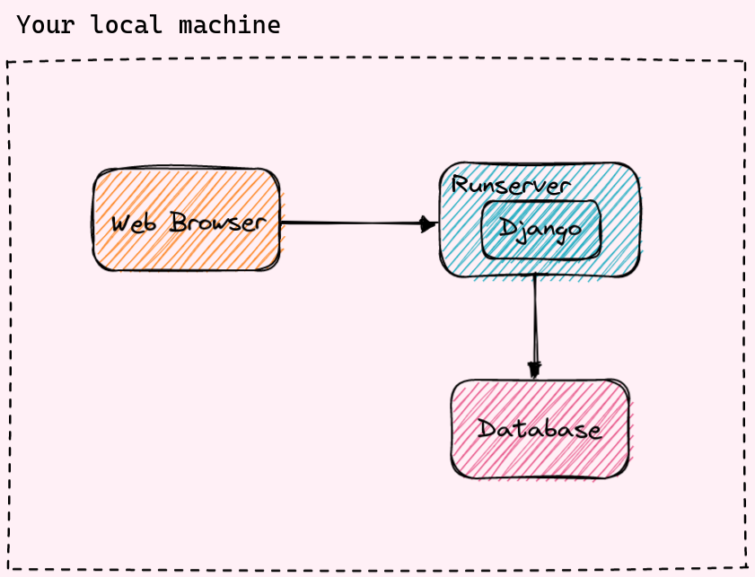
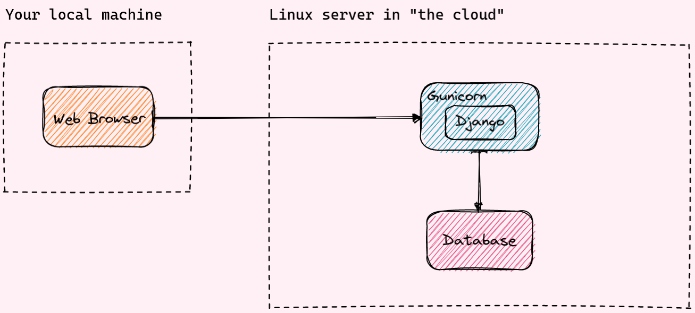
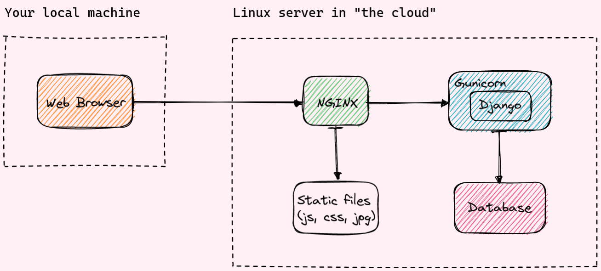
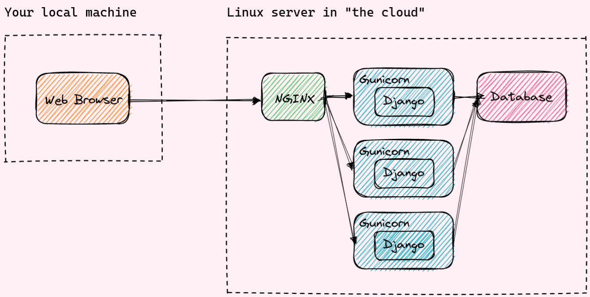
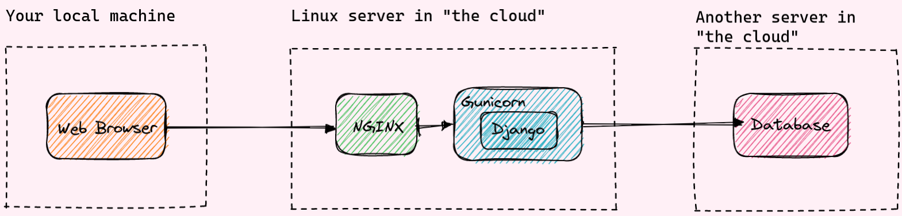
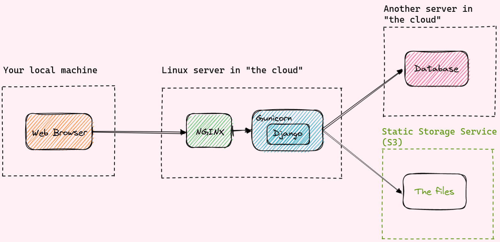
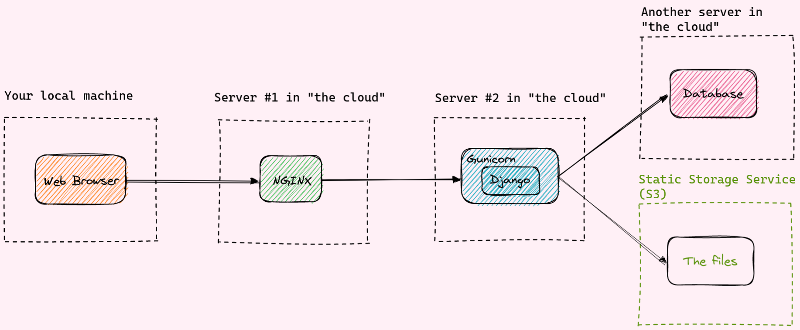
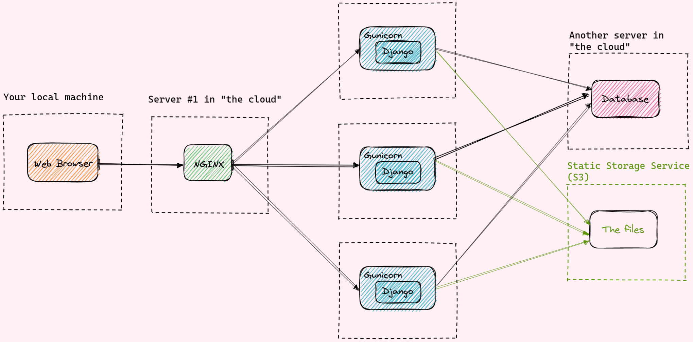

# Django server setups

#### Things to mention at the beginning

* Each next step / picture assumes that the current setup can’t handle the load (users, traffic, etc.) and we need to improve it (= make it more reliable / stable).
* This looks like more *“monolith”* approach (the approach with micro services is not really about Django).
* Tech choices in the examples might be different - you need to get an overall idea.
* There is no focus on *how* we deploy things - it's about *what* we deploy
* The approach assumes that everything deployed on VPS directly - with dockerizing it would work basically the same way... except everything is inside a Docker container.

## Your local machine

* Your web browser (Chrome, Safari, Firefox, etc).
* Django the `runserver` management command.
* Some database (usually SQLite at the beginning).

## **Simple standalone server**

* Instead of `runserver` - a WSGI server like Gunicorn:

  > DO NOT USE THIS SERVER IN A PRODUCTION SETTING. It has not gone through security audits or performance tests. (And that’s how it’s gonna stay. We’re in the business of making Web frameworks, not Web servers, so improving this server to be able to handle a production environment is outside the scope of Django.)

## Typical standalone server

The main differences:

* A NGINX is now sitting in-front of Gunicorn in a "reverse-proxy" setup.

* Static files are now being served from outside of Django.

Why add NGINX? (alternatives - Apache HTTP server and Traefik).

* A dedicated webserver provides extra features and performance improvements over just using Gunicorn to serve web requests.
    * directly serve static and media files more efficiently.
    * encrypt web traffic using HTTPS (if you set it up).
    * compress your files to make your site faster.

## Single server with multiple Django apps

After we start using NGINX, we can run multiple Django apps on the same machine.
This also allows to re-use some of the services and configurations.

NGINX is able to route incoming HTTP requests to different apps based on the domain name.

#### Note: why we would not like to keep everything on one server

* If your server restarts or shuts off, so does your website (and all you apps).
* If the server goes away, so does all your data: Django DB tables, files uploaded by users, (`MEDIA_ROOT` folder, somewhere on your filesystem).
* This is getting to be even more important in the modern world when sometimes it's easier to terminate and reprovision an instance instead of figuring out why it does not respond.

## Using more separate machines / external services

* split up services into smaller units, based on their "responsibilities".
* We're going to pull apart our services until there's nothing left.
    * you might not need to do this for your services, this is just an overview of what you *could* do.

## Database as external service

You can set this up yourself or pay extra money for service like Amazon RDS (or some other managed DB).

There are a couple of reasons:

* DB performance will not be impacted by "noisy neighbours" eating up CPU, RAM or disk space on the same machine.
* Move DB away from Django server - you can delete and re-create Django app's server with less concern.
* You might have multiple apps on different servers that depend on the same database.

## Object storage as external service

It is common to push file storage off the web server into "object storage".
Object storage is usually used for user-uploaded "media" such as documents, photos and videos. And static files.

* Moved all of app's state (files, database) off of the server, so now we can move, destroy and re-create the Django server with no data loss.
* File downloads hit the object storage service, rather than the server, meaning you can scale your file downloads more easily.
* No need to worry about any file system administration (running out of disk space).
* Multiple servers can easily share the same set of files.

## Web server as external service

You might have multiple identical app servers set up for redundancy and to handle high traffic, and NGINX can act as a "load balancer" between the different servers.

You could replace NGINX with a load balancer like an AWS Elastic Load Balancer or something similar.

\* putting our services on their own servers allows scaling them out over multiple VMs. We couldn't run our Django app on three 3 at the same time if we also had 3 copies of our filesystem and 3 databases.

## Other services to mention

* Cache - on the server and as a separate service (Redis, Memcached, etc.).
* Task Queue - on the server and as a separate service (Celery, etc.).

## Conclusion

This is all about trade-offs and balance.

That said, there are many benefits to this setup:

* Web app servers are completely replaceable, you can destroy, create and update them without affecting uptime at all.
* Files and database are easily shared between multiple servers and applications.
* Can now autoscale your servers.
* Can provision different sized servers for their different workloads.
* Can now do "blue-green deployments" with zero web app downtime.
* Can replace self-managed servers for managed infrastructure, like moving task broker to AWS SQS, or database to AWS RDS.

Though, that's all could be possible with tools like Ansible and Packer to configure Vms, and tools like Terraform or CloudFormation to configure cloud services.
